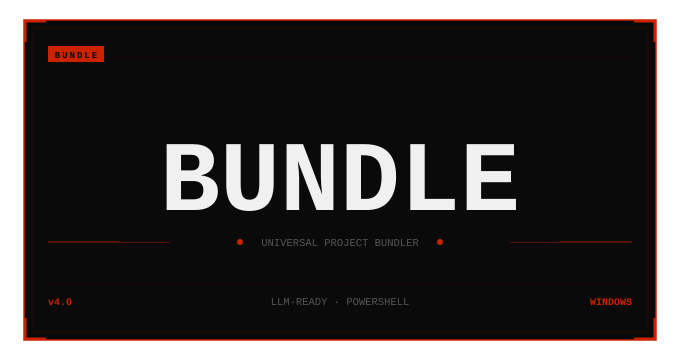

# BUNDLE



BUNDLE is a PowerShell project packaging tool that scans a source folder and creates a single AI-ready project bundle. It is intended for developers who want to share a readable snapshot of a codebase with an AI assistant or keep a structured project export for review.

## Why This Project Exists

Large projects are difficult to paste into AI tools file by file. BUNDLE collects supported source files, basic project metadata, code metrics, dependency hints, and optional security findings into one output file so the project can be reviewed more easily.

## What It Does

- Scans a selected project folder recursively.
- Excludes common dependency, build, cache, binary, and private environment files.
- Bundles supported source and documentation files into `txt`, `md`, `json`, or `html`.
- Estimates token usage.
- Detects common project types and likely entry points.
- Extracts simple dependency/export information using language-aware regex patterns.
- Calculates basic metrics such as line counts, simple complexity, and duplicate-line ratio.
- Scans for possible secrets and can redact matched values with `-Redact`.
- Can generate an HTML analysis report.

## Use Cases

- Prepare a project snapshot for an AI code review.
- Share a compact source-code bundle for debugging.
- Create a portfolio-friendly overview of a codebase.
- Check a project for obvious secret patterns before sharing.

## Tech Stack

- PowerShell 7+
- No external package dependencies
- Optional Git metadata if Git is installed and the target folder is a Git repository

## Requirements

- PowerShell 7 or newer (`pwsh`)
- Windows, macOS, or Linux

PowerShell 7 is recommended because the script uses modern PowerShell syntax and UTF-8 console output.

## Installation

Clone the repository or download `BUNDLE.ps1`.

```powershell
git clone https://github.com/ff7hpp/BUNDLE.git
cd BUNDLE
```

## Usage

Run the script from PowerShell and point it at the project you want to bundle.

```powershell
pwsh -NoProfile -ExecutionPolicy Bypass -File .\BUNDLE.ps1 -ProjectRoot "C:\path\to\project" -OutputDir "C:\path\to\output" -Format md -Redact
```

Common options:

| Option | Description |
| --- | --- |
| `-ProjectRoot` | Project folder to scan. Defaults to the current folder. |
| `-OutputDir` | Folder where the bundle will be written. Defaults to the project folder. |
| `-OutputFile` | Custom output filename. |
| `-Format` | Output format: `txt`, `md`, `json`, or `html`. |
| `-Redact` | Replaces detected secret values in bundle content and report metadata. |
| `-GenerateHTML` | Writes an HTML report next to non-HTML outputs. |
| `-BuildDepGraph` | Builds a simple dependency graph from extracted imports. |
| `-DryRun` | Scans and analyzes files without writing output. |
| `-ExtraExtensions` | Adds file extensions to include. |
| `-ExtraExcludes` | Adds folder names to exclude. |

## Example Command

```powershell
pwsh -NoProfile -ExecutionPolicy Bypass -File .\BUNDLE.ps1 `
  -ProjectRoot . `
  -OutputDir . `
  -OutputFile bundle.md `
  -Format md `
  -Redact `
  -BuildDepGraph
```

## Example Output

```text
PROJECT INTELLIGENCE BUNDLE

Total Files: 12
Estimated Tokens: 18.4 K
Risk Level: LOW (91/100)
Security Findings: 0

## File Contents
### src/main.py
...
```

See [`examples/example-output.md`](examples/example-output.md) for a short sample excerpt.

## Project Structure

```text
BUNDLE/
├── BUNDLE.ps1
├── README.md
├── LICENSE
├── .gitignore
├── bundle_logo_v4.svg
└── examples/
    └── example-output.md
```

## Security And Privacy Notes

BUNDLE is designed to help avoid accidental sharing, but it cannot guarantee that every sensitive value will be detected.

Before sharing any generated bundle:

- Do not include `.env` files.
- Do not include API keys.
- Do not include private keys.
- Do not include credentials or tokens.
- Do not include personal data.
- Do not bundle sensitive or private project files unless that is intentional.
- Review the generated output manually, even when using `-Redact`.

The script excludes `.env` by default while allowing safer template files such as `.env.example` and `.env.sample`.

## Important Warnings

- Secret scanning is regex-based and can produce false positives or miss unusual secret formats.
- Dependency extraction is regex-based, not a full compiler or AST parser.
- HTML and JSON reports may contain file names, paths, and code snippets from the scanned project.
- Use `-Redact` when preparing output for external sharing.
- Prefer writing output outside the scanned project folder to avoid bundling previous generated outputs on later runs.

## Future Improvements

- Add automated tests for all output formats.
- Improve dependency resolution with language-specific parsers.
- Add a safer default output folder outside the scanned project.
- Add CI validation for parser checks and smoke tests.
- Improve documentation for advanced flags and examples.

## Author / Contact

Created by `ff7hpp`.

GitHub: [https://github.com/ff7hpp](https://github.com/ff7hpp)

## License

MIT License. See [`LICENSE`](LICENSE).
